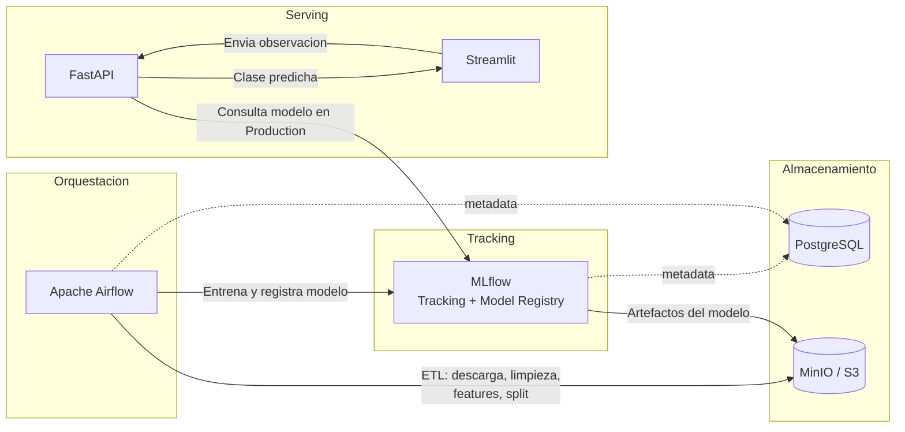

### Stellar Classification - CEIA - FIUBA
## Integrantes
- Marcos Riveros a2537
- Franco Morero a2533
- Tadeo Riveros a2536

## Descripción del proyecto

Pipeline de MLOps para clasificar objetos astronómicos (`GALAXY`, `QSO`, `STAR`) a partir de mediciones
fotométricas del dataset [Stellar Classification Dataset - SDSS17](https://www.kaggle.com/datasets/fedesoriano/stellar-classification-dataset-sdss17).
Cubre el ciclo completo: ingesta y ETL de datos, entrenamiento y registro de modelos en MLflow, y una API
más un frontend para generar predicciones con el modelo en producción.

Para simular esta empresa, utilizaremos Docker y, a través de Docker Compose, desplegaremos varios
contenedores que representan distintos servicios en un entorno productivo.

## Arquitectura

Diagrama de infraestructura de base (Airflow, MLflow, MinIO, PostgreSQL, Redis):


Flujo de datos y predicción, incluyendo la API y el frontend:



Los servicios que contamos son:

| Servicio | Rol | Puerto por defecto |
|---|---|---|
| [Apache Airflow](https://airflow.apache.org/) | Orquesta los DAGs de ETL y entrenamiento | 8080 |
| [MLflow](https://mlflow.org/) | Tracking de experimentos y Model Registry | 5001 |
| [MinIO](https://min.io/) | Almacenamiento S3-compatible para datos y artefactos | 9000 (API) / 9001 (consola) |
| Base de datos relacional [PostgreSQL](https://www.postgresql.org/) | Metadata de Airflow y de MLflow | 5432 |
| Base de dato key-value [ValKey](https://valkey.io/) | Broker de Celery para Airflow | interno (no expuesto) |
| API Rest para servir modelos ([FastAPI](https://fastapi.tiangolo.com/)) | Recibe observaciones y devuelve la clase predicha | 8800 |
| Frontend ([Streamlit](https://streamlit.io/)) | Formulario para cargar una observación y ver la predicción | 8501 |

### Pipeline de datos y modelo

1. **`etl_process`** (DAG de Airflow): descarga el dataset desde Kaggle, limpia los datos, genera las
   features derivadas (índices de color `u_g`, `g_r`, `r_i`, `i_z`), codifica la clase objetivo con
   `LabelEncoder` (guardando el mapeo en `s3://data/metadata/class_mapping.json`) y arma los splits de
   train/search/test. Todo queda en el bucket `data` de MinIO.
2. **`train_the_model`** (DAG de Airflow): busca hiperparámetros con Optuna y validación cruzada, entrena
   el modelo final (`XGBClassifier`), lo registra en MLflow (adjuntando el `class_mapping` como metadata
   del modelo) y lo compara por F1-macro contra la versión actual en stage `Production` para decidir si
   lo promueve.
3. **FastAPI** carga el modelo en `Production` desde MLflow y expone el endpoint de predicción.
4. **Streamlit** es el frontend que arma el formulario de observación y muestra la clase predicha.

### Programación de los DAGs

El pipeline corre solo, sin pasos manuales:

| DAG | Schedule | Cómo se dispara |
|---|---|---|
| `etl_process` | `@monthly` (cron `0 0 1 * *`, el día 1 de cada mes a las 00:00) | Automático, por cron |
| `train_the_model` | Ninguno (`schedule=None`) | Automático: la última tarea de `etl_process` (`trigger_train_the_model`, un `TriggerDagRunOperator`) lo dispara apenas termina de dejar los datos listos en S3. También se puede disparar a mano desde la UI/API de Airflow para un reentrenamiento puntual sin esperar al próximo ciclo mensual. |

`train_the_model` no tiene cron propio a propósito, para no arrancar en paralelo con una corrida de `etl_process`
que todavía no terminó de generar los splits de train/test que necesita.

Nota: en un deploy nuevo (base de datos de Airflow vacía), ambos DAGs nacen **pausados** por la configuración
`AIRFLOW__CORE__DAGS_ARE_PAUSED_AT_CREATION: 'true'`. Hay que despausarlos una única vez (toggle en la UI, o
`airflow dags unpause etl_process`) para que el cron empiece a correr solo.

Por defecto, cuando se inician los multi-contenedores, se crean los siguientes buckets:

- `s3://data`
- `s3://mlflow` (usada por MLflow para guardar los artefactos).

y las siguientes bases de datos:

- `mlflow_db` (usada por MLflow).
- `airflow` (usada por Airflow).

## Instalación

1. Para poder levantar todos los servicios, ejecuta:

```bash
docker compose --profile all up
```

2. Acceder a los diferentes servicios mediante:
   - Apache Airflow: http://localhost:8080
   - MLflow: http://localhost:5001
   - MinIO: http://localhost:9001 (ventana de administración de Buckets)
   - API: http://localhost:8800/
   - Documentación de la API: http://localhost:8800/docs
   - Frontend (Streamlit): http://localhost:8501


Todos los puertos u otras configuraciones se pueden modificar en el archivo `.env`. Se invita a jugar y romper para aprender; siempre puedes volver a clonar este repositorio.

## Endpoints de la API (FastAPI)

| Método | Ruta | Descripción | Errores |
|---|---|---|---|
| GET | `/` | Chequeo de salud de la API | - |
| GET | `/modelos` | Lista todas las versiones de modelos registradas en MLflow | - |
| GET | `/modelos/produccion` | Devuelve la versión del modelo `stellar_classification_xgb` en stage `Production` | `404` si no hay modelo en producción, `502` si falla la conexión con MLflow |
| POST | `/observaciones` | Recibe una observación (`alpha`, `delta`, `u`, `g`, `r`, `i`, `z`, `redshift`), la valida y devuelve la clase predicha (`GALAXY`, `QSO` o `STAR`) usando el modelo en producción | `422` si los datos no pasan validación, `404`/`502` si falla MLflow o la predicción |

La documentación interactiva (Swagger) queda disponible en `http://localhost:8800/docs`.

